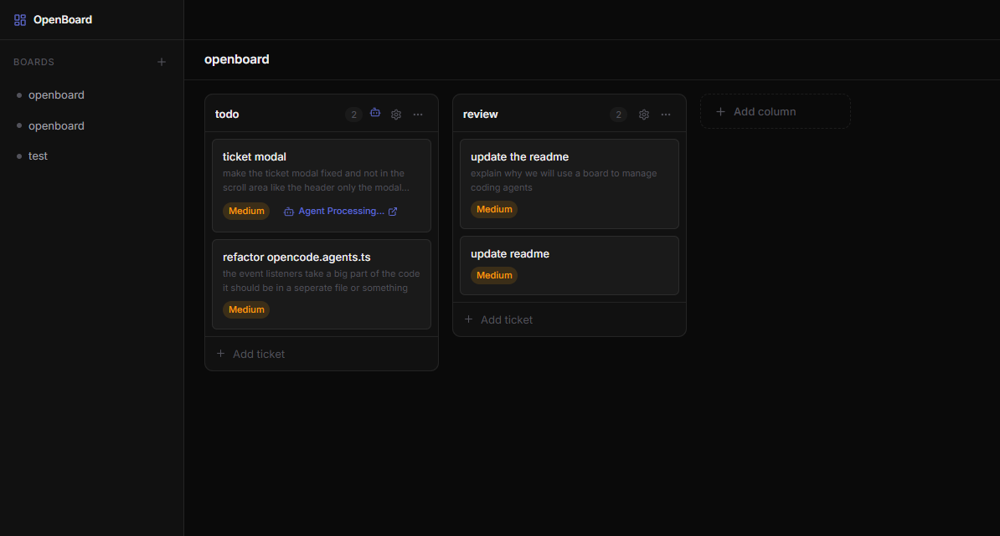

# Openboard: The AI Agent Orchestration Board
This is a work on progress, contribuations are welcome.




Openboard is not just another Kanban board—it is an orchestration platform specifically designed to **manage, monitor, and collaborate with autonomous AI coding agents**. While it features a real-time Kanban interface built with React and Node.js, our primary focus is on providing a seamless environment for agents to pick up tasks, execute them in isolation, and submit their work.

## Why Openboard? Managing Coding Agents

We use a Kanban board as the central nervous system for AI agents for several key reasons:

- **Visibility and Tracking**: A board provides a clear, visual representation of what each agent is currently working on, what tasks are queued, and what has been completed.
- **Task Decomposition**: Complex software engineering tasks can be broken down into smaller, manageable tickets, allowing multiple agents to work in parallel on different components.
- **State Management**: The board acts as a centralized state machine for the agents' progress. If an agent encounters an error or requires human approval, the ticket status reflects this immediately.
- **Prioritization**: Easily reorder tickets in the backlog to direct the agents' focus to the most critical tasks first.
- **Seamless Collaboration**: Facilitates handoffs between specialized agents (e.g., an architecture agent breaking down a task into tickets, which are then picked up by implementation agents).

## How Agents Work: Git Worktrees & GitHub CLI

To allow multiple agents to work in parallel without tripping over each other, Openboard leverages **Git Worktrees** and the **GitHub CLI (`gh`)**. 

- **Git Worktrees**: When an agent picks up a ticket, it doesn't just check out a branch in your main project folder. Instead, it creates an isolated feature branch and a dedicated git worktree for it. This provides the agent with its own physical directory and working tree to modify files, run tests, and commit changes comfortably, all while ensuring your main workspace remains untouched.
- **PR Generation (`gh`)**: Once the agent finishes its implementation, it uses the GitHub CLI to automatically push its branch and open a Pull Request for human review, progressing the ticket to a "Needs Approval" state on the board.

## QuickStart

Make sure you have opencode, git and gh cli installed.
Your folder should already have git init and a github repo configured.

```
cd /path/to/project
npx @m0xoo/openboard
```

## Tech Stack

### Frontend (`packages/client`)
- **Framework:** React with Vite
- **Language:** TypeScript
- **Styling:** CSS Modules, Global CSS variables
- **Routing:** React Router DOM
- **Interactions:** `@dnd-kit` for drag-and-drop
- **Icons:** Lucide React

### Backend (`packages/server`)
- **Runtime:** Node.js
- **Framework:** Express
- **Language:** TypeScript
- **Database:** SQLite (via `sql.js`)
- **Real-time:** Server-Sent Events (SSE)

## Prerequisites

Before running Openboard, ensure you have the following installed on your system:

- **[Node.js](https://nodejs.org/)** (v18 or newer recommended) & npm
- **[Git](https://git-scm.com/)**: Required for agents to manage versions and worktrees. Ensure `git` is available in your PATH.
- **[GitHub CLI (`gh`)](https://cli.github.com/)**: Required for agents to authenticate and create Pull Requests. Ensure `gh` is available in your PATH and you are authenticated by running `gh auth login` before starting the agents.

## Getting Started

1. **Install dependencies**

   Run this command in the root directory. This will install dependencies for both the client and server workspaces:
   ```bash
   npm install
   ```

2. **Environment Variables**
   
   Navigate to the `packages/client` directory and copy the example environment file:
   ```bash
   cp packages/client/.env.example packages/client/.env
   ```

3. **Start the development servers**

   Start both the frontend and backend simultaneously using concurrently:
   ```bash
   npm run dev
   ```

   - The **client** will be available at: [http://localhost:5173](http://localhost:5173)
   - The **server** will run on: [http://localhost:3001](http://localhost:3001)

4. **Build and Run for Production**

   To build both the client and server for a production environment:
   ```bash
   npm run build
   ```
   To start the production servers simultaneously:
   ```bash
   npm run start
   ```
   Or use `npm run prod` to build and start in one command.

## Project Structure

```text
openboard/
├── package.json          # Root workspace configuration
├── packages/
│   ├── client/           # React frontend application
│   │   ├── src/          # Components, Context, Styles
│   │   └── package.json
│   └── server/           # Express backend application
│       ├── src/          # Routes, Database logic, SSE, Agent logic
│       └── package.json
```
